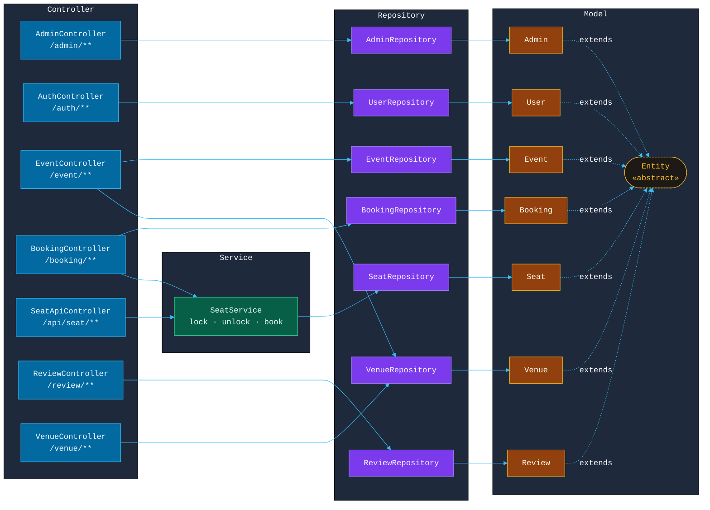

# TixCore Spring Boot MVC Architecture
> Each domain flows **Controller → Service → Repository → Model**

---

---

## Layer Summary

| Layer | Classes | Responsibility |
|-------|---------|----------------|
| **Controller**  | 7 controllers | HTTP endpoints & request routing |
| **Service**  | SeatService | Seat locking & concurrency logic |
| **Repository**  | 7 repositories | CSV-based persistence via FileRepository |
| **Model**  | 7 models + Entity | Domain objects, all extend abstract `Entity` |
