# 🗂️ Class Diagram – Event Booking System

```mermaid
classDiagram
    direction TB

    %% ─── Base Entity ───────────────────────────────────────────────
    class Entity {
        <<abstract>>
        #id : String
        #createdAt : String
        +getId() String
        +setId(String) void
        +getCreatedAt() String
        +setCreatedAt(String) void
        +serialize() String
    }

    %% ─── Core Domain Classes ────────────────────────────────────────
    class Event {
        -title : String
        -description : String
        -category : String
        -date : String
        -time : String
        -venueId : String
        -basePrice : double
        -status : String
        +getTitle() String
        +setTitle(String) void
        +getCategory() String
        +setCategory(String) void
        +getDate() String
        +setDate(String) void
        +getTime() String
        +setTime(String) void
        +getVenueId() String
        +setVenueId(String) void
        +getBasePrice() double
        +setBasePrice(double) void
        +getStatus() String
        +setStatus(String) void
        +serialize() String
        +deserialize(String)$ Event
    }

    class Venue {
        -name : String
        -address : String
        -city : String
        -capacity : int
        +getName() String
        +setName(String) void
        +getAddress() String
        +setAddress(String) void
        +getCity() String
        +setCity(String) void
        +getCapacity() int
        +setCapacity(int) void
        +serialize() String
        +deserialize(String)$ Venue
    }

    class Booking {
        -userId : String
        -eventId : String
        -seats : String
        -totalPrice : double
        -status : String
        +getUserId() String
        +setUserId(String) void
        +getEventId() String
        +setEventId(String) void
        +getSeats() String
        +setSeats(String) void
        +getTotalPrice() double
        +setTotalPrice(double) void
        +getStatus() String
        +setStatus(String) void
        +serialize() String
        +deserialize(String)$ Booking
    }

    class Seat {
        <<static constants>>
        +AVAILABLE : String$
        +LOCKED : String$
        +BOOKED : String$
        -eventId : String
        -rowLabel : String
        -seatNumber : int
        -status : String
        -lockedUntil : long
        -lockedBy : String
        +getCode() String
        +getEventId() String
        +setEventId(String) void
        +getRowLabel() String
        +setRowLabel(String) void
        +getSeatNumber() int
        +setSeatNumber(int) void
        +getStatus() String
        +setStatus(String) void
        +getLockedUntil() long
        +setLockedUntil(long) void
        +getLockedBy() String
        +setLockedBy(String) void
        +serialize() String
        +deserialize(String)$ Seat
    }

    class Review {
        -userId : String
        -eventId : String
        -rating : int
        -comment : String
        +getUserId() String
        +setUserId(String) void
        +getEventId() String
        +setEventId(String) void
        +getRating() int
        +setRating(int) void
        +getComment() String
        +setComment(String) void
        +serialize() String
        +deserialize(String)$ Review
    }

    %% ─── User Classes ───────────────────────────────────────────────
    class User {
        -username : String
        -email : String
        -fullName : String
        -phone : String
        -password : String
        -profileImage : String
        +getUsername() String
        +setUsername(String) void
        +getEmail() String
        +setEmail(String) void
        +getFullName() String
        +setFullName(String) void
        +getPhone() String
        +setPhone(String) void
        +getPassword() String
        +setPassword(String) void
        +getProfileImage() String
        +setProfileImage(String) void
        +serialize() String
        +deserialize(String)$ User
    }

    class Admin {
        -username : String
        -email : String
        -fullName : String
        -role : String
        -password : String
        +getUsername() String
        +setUsername(String) void
        +getEmail() String
        +setEmail(String) void
        +getFullName() String
        +setFullName(String) void
        +getRole() String
        +setRole(String) void
        +getPassword() String
        +setPassword(String) void
        +serialize() String
        +deserialize(String)$ Admin
    }

    %% ─── Inheritance ─────────────────────────────────────────────────
    Entity <|-- Event
    Entity <|-- Venue
    Entity <|-- Booking
    Entity <|-- Seat
    Entity <|-- Review
    Entity <|-- User
    Entity <|-- Admin

    %% ─── Associations ────────────────────────────────────────────────
    User        "1" --> "*" Booking  : makes
    User        "1" --> "*" Review   : writes
    Event       "1" --> "*" Booking  : has
    Event       "1" --> "*" Review   : receives
    Event       "1" --> "*" Seat     : contains
    Venue       "1" --> "*" Event    : hosts
    Booking     "*" --> "1" Seat     : reserves
```

---

## 🧩 Class Responsibilities

| Class     | Layer    | Responsibility                                                                      |
| --------- | -------- | ----------------------------------------------------------------------------------- |
| `Entity`  | Base     | Provides `id` and `createdAt` to all domain objects; defines `serialize()` contract |
| `Event`   | Domain   | Represents a bookable event tied to a venue                                         |
| `Venue`   | Domain   | Physical location that hosts events                                                 |
| `Booking` | Domain   | Records a user's reservation for an event and selected seats                        |
| `Seat`    | Domain   | Individual seat within an event; tracks lock/book state                             |
| `Review`  | Domain   | User-submitted rating and comment for an attended event                             |
| `User`    | Identity | End-user account with profile and authentication data                               |
| `Admin`   | Identity | System administrator with a specific role                                           |

---

## 🔗 Relationship Summary

| From | To | Type | Multiplicity | Description |
|------|----|------|-------------|-------------|
| `Entity` | All classes | Inheritance | 1 → * | All domain classes extend `Entity` |
| `User` | `Booking` | Association | 1 → * | A user can make multiple bookings |
| `User` | `Review` | Association | 1 → * | A user can write multiple reviews |
| `Event` | `Booking` | Association | 1 → * | An event can have many bookings |
| `Event` | `Review` | Association | 1 → * | An event can receive many reviews |
| `Event` | `Seat` | Association | 1 → * | An event contains many seats |
| `Venue` | `Event` | Association | 1 → * | A venue hosts many events |
| `Booking` | `Seat` | Association | * → 1 | Multiple bookings reference a seat |

---

## ⚙️ Design Notes & Optimizations

### ✅ Applied Improvements over Original Diagram

1. **Unified `serialize()`/`deserialize()` contract** — Moved repetitive method declarations into the abstract `Entity` base, reducing redundancy across all subclasses.
2. **Static factory methods marked with `$`** — All `deserialize(String)` methods are static factories; clearly marked as `ClassName$` per UML convention.
3. **Seat status constants extracted** — `AVAILABLE`, `LOCKED`, and `BOOKED` are modelled as `static` class-level constants (marked with `$`) rather than plain fields.
4. **Multiplicity made explicit** — All associations now carry labelled multiplicities (`1`, `*`, `1..*`) for clarity.
5. **`Admin` kept separate from `User`** — Avoids a fragile single-table inheritance hierarchy; each has its own clean field set.
6. **Removed ambiguous arrows** — Original diagram mixed inheritance and association arrows inconsistently; this version uses strict Mermaid conventions.

### 💡 Further Recommendations (not yet implemented)

- Consider extracting a `BaseUser` class that `User` and `Admin` both extend, sharing `username`, `email`, `fullName`, and `password`.
- `Seat.lockedUntil : long` could be typed as `Instant`/`LocalDateTime` in a real Java implementation.
- `Booking.seats : String` is a raw string — consider a `List<String>` or a join table for seat references.
- `Event.venueId : String` is a foreign key; in an ORM context this would be a `Venue` reference directly.
